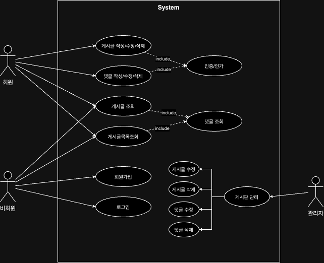
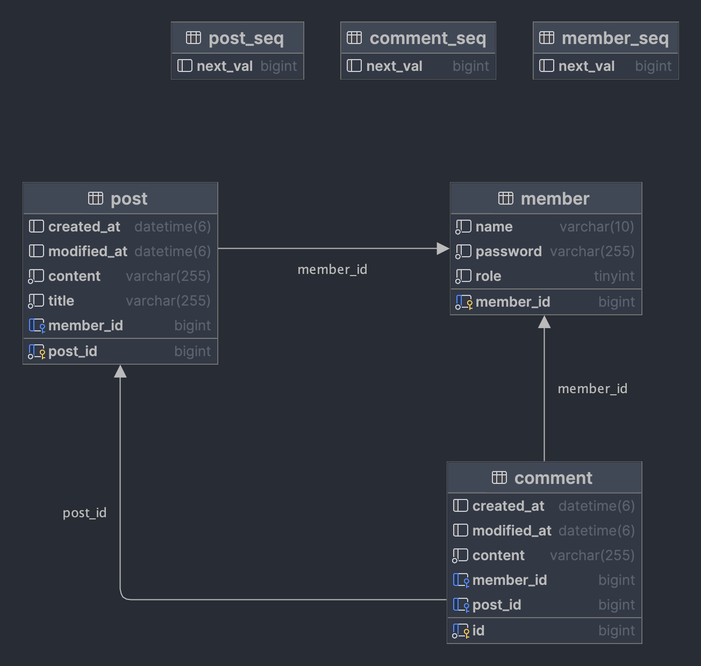

## Backend API
Springboot 기반 간단한 게시판 기능 구현

### 문서화
[API Documentation](https://documenter.getpostman.com/view/22831919/2s9YXfbPDq)

[Run api in postman](https://www.postman.com/cece-07/workspace/my-workspace/collection/22831919-aefc6dc5-a577-4a00-9a08-37f7c4591f86?action=share&creator=22831919)

[👊 페이징 시연](https://www.postman.com/cece-07/workspace/my-workspace/collection/22831919-60a52f21-56b3-4b71-a79e-e56f17afef2d?action=share&creator=22831919)

### 설계
#### Usecase Diagram

#### Entity Relationship Diagram

